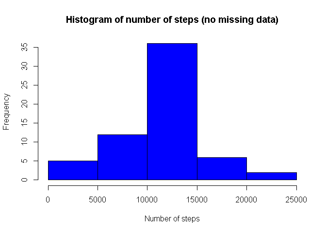

# Reproducible Research: Peer Assessment 1

## Basic steps

```r
echo=TRUE
library(ggplot2)
library(lattice) # For last plot as given in the description
```

## Loading and preprocessing the data

```r
activity_data<-read.csv(unz("./activity.zip", filename="activity.csv"),header=TRUE,na.strings=c("NA"),colClasses=c("integer","Date","factor"))
activity_data$month<-as.numeric(format(activity_data$date, "%m")) # For plotting
na_omitted<-na.omit(activity_data)
```

## What is mean total number of steps taken per day?
For this part of the assignment, you can ignore the missing values in the datase

- Calculate and report the mean and median total number of steps taken per day

```r
steps_day<-aggregate(na_omitted$steps, list(na_omitted$date), FUN="sum")
old_mean<-mean(steps_day[,2])
old_median<-median(steps_day[,2])
old_mean
```

```
## [1] 10766.19
```

```r
old_median
```

```
## [1] 10765
```

- Make a histogram of the total number of steps taken each day

```r
hist(steps_day[,2],main="Histogram of number of steps taken each day",xlab="Number of steps",ylab="Frequency",col="blue")
```

 

## What is the average daily activity pattern?
- Make a time series plot (i.e. type = "l") of the 5-minute interval (x-axis) and the average number of steps taken, averaged across all days (y-axis)

```r
steps_average<-aggregate(na_omitted$steps, list(as.numeric(as.character(na_omitted$interval))), FUN="mean")
names(steps_average)[1]<-"Interval" ## To be used in aes
names(steps_average)[2]<-"StepsMean" ## To be used in aes
ggplot(steps_average, aes(Interval, StepsMean)) + geom_line(color="blue") + labs(title="Time Series Plot", x="5-minute intervals", y="Average Number of Steps")
```

 

- Which 5-minute interval, on average across all the days in the dataset, contains the maximum number of steps?

```r
steps_average[steps_average$StepsMean==max(steps_average$StepsMean),1]
```

```
## [1] 835
```

## Imputing missing values
Note that there are a number of days/intervals where there are missing values (coded as NA). The presence of missing days may introduce bias into some calculations or summaries of the data.

- Calculate and report the total number of missing values in the dataset (i.e. the total number of rows with NAs)

```r
sum(is.na(activity_data))
```

```
## [1] 2304
```

- Devise a strategy for filling in all of the missing values in the dataset. The strategy does not need to be sophisticated. For example, you could use the mean/median for that day, or the mean for that 5-minute interval, etc.

- Create a new dataset that is equal to the original dataset but with the missing data filled in.

```r
data_no_na<-activity_data
## Imputing missing values with mean steps of corresponding interval
for(i in which(is.na(data_no_na$steps))) {
  data_no_na$steps[i]<-steps_average[which(data_no_na$interval[i]==steps_average$Interval),]$StepsMean
}
head(data_no_na)
```

```
##       steps       date interval month
## 1 1.7169811 2012-10-01        0    10
## 2 0.3396226 2012-10-01        5    10
## 3 0.1320755 2012-10-01       10    10
## 4 0.1509434 2012-10-01       15    10
## 5 0.0754717 2012-10-01       20    10
## 6 2.0943396 2012-10-01       25    10
```

```r
steps_day<-aggregate(data_no_na$steps, list(data_no_na$date), FUN="sum")
```

- Make a histogram of the total number of steps taken each day and Calculate and report the mean and median total number of steps taken per day. Do these values differ from the estimates from the first part of the assignment? What is the impact of imputing missing data on the estimates of the total daily number of steps?

```r
## Similar plot as the first plot
hist(steps_day[,2],main="Histogram of number of steps (no missing data)",xlab="Number of steps",ylab="Frequency",col="blue")
```

 

```r
new_steps<-aggregate(data_no_na$steps, list(data_no_na$date), FUN="sum")
new_mean<-mean(new_steps[,2])
new_median<-median(new_steps[,2])
new_mean-old_mean
```

```
## [1] 0
```

```r
new_median-old_median
```

```
## [1] 1.188679
```

## Are there differences in activity patterns between weekdays and weekends?
For this part the weekdays() function may be of some help here. Use the dataset with the filled-in missing values for this part.

- Create a new factor variable in the dataset with two levels - "weekday" and "weekend" indicating whether a given date is a weekday or weekend day.

```r
data_no_na$day<-factor(format(data_no_na$date, "%A"))
levels(data_no_na$day)<-list(weekday=c("Monday", "Tuesday", "Wednesday", "Thursday", "Friday"), weekend=c("Saturday", "Sunday")) # Setting weekdays and weekends
```

- Make a panel plot containing a time series plot (i.e. type = "l") of the 5-minute interval (x-axis) and the average number of steps taken, averaged across all weekday days or weekend days (y-axis). See the README file in the GitHub repository to see an example of what this plot should look like using simulated data.

```r
## Replacing steps_average
steps_average<-aggregate(data_no_na$steps, list(as.numeric(as.character(data_no_na$interval)), data_no_na$day), FUN="mean")
names(steps_average)[1] <- "Interval"
names(steps_average)[2] <- "Day"
names(steps_average)[3] <- "StepsMean"
xyplot(steps_average$StepsMean ~ steps_average$Interval | steps_average$Day, layout=c(1, 2), type="l", xlab="Interval", ylab="Number of steps")
```

 
